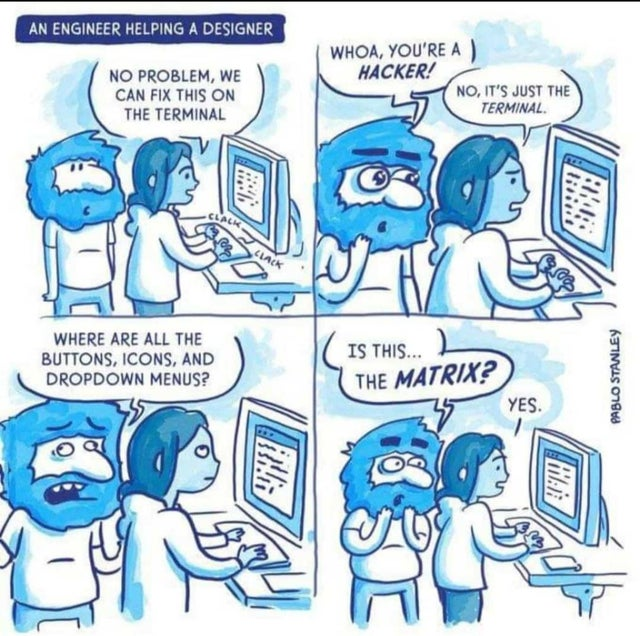

## Guesser

This is a simple game where you're given a letter and you have to guess its index number.

- In `Guesser.js`, define a function called `letterGuesser`.
- Inside your function, create an array of letters from "a" to "z" and save this array to a variable.
- Using `Math.random()`, generate a random number between 0 and the length of your alphabet array. Save this number to a variable.
- Use that random number as an index to select the correlating letter from your alphabet array.
- Using string interpolation and `prompt()`, inform the user what letter they have received, ask the user to guess the letter's index number, and save that guess to a variable.
- Make sure the guess's data type is a number!
- Use conditional logic to check if the user's guess matches the actual index of the random letter. If it does, use `alert()` to tell them that they're a genius at the alphabet; if it doesn't match, tell them that they need to learn their ABCs and use string interpolation to give them the correct answer.
- Call `letter_guesser`.
- Save your work, go to the browser, and refresh to run the file you just created.

The result should look something like this:

```
Your letter is c. Guess c's index number.
2
You definitely know the alphabet!
```

```
Prompt: Your letter is z. Guess z's index number.
1
incorrect, you will have to re-learn the abc's. The index of z is actually 25.
```
